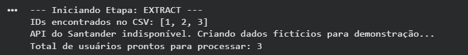
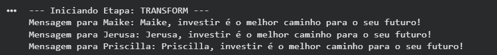
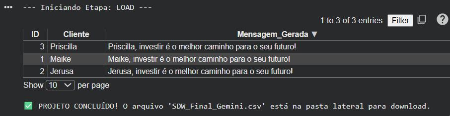

# 🚀 Santander Dev Week 2023 - ETL com IA Generativa (Google Gemini)

Este projeto foi desenvolvido como parte do Lab de Ciência de Dados da **DIO (Digital Innovation One)**. O objetivo é demonstrar um ciclo completo de **ETL (Extract, Transform, Load)**, utilizando Python para processar dados de clientes e a API do **Google Gemini** para gerar mensagens de marketing personalizadas.

## 📋 Contexto do Desafio
O desafio consiste em simular o papel de um cientista de dados no Santander que precisa engajar clientes de forma personalizada. A solução automatiza a criação de mensagens sobre investimentos para cada cliente da base.

## 🛠️ Tecnologias e Ferramentas
* **Linguagem:** Python 3.x
* **IA Generativa:** Google Gemini 1.5 Flash (via `google-genai`)
* **Manipulação de Dados:** Pandas
* **Ambiente de Execução:** Google Colab
* **API de Dados:** Santander Dev Week 2023 API

## 🔄 O Fluxo ETL

### 1. Extract (Extração)
O pipeline extrai IDs de usuários a partir de um arquivo `SDW2023.csv`. O script tenta buscar os dados completos de cada cliente na API do Santander. Caso a API esteja offline, o sistema possui um mecanismo de *fallback* que utiliza dados locais para garantir a continuidade do processo.

### 2. Transform (Transformação)
Utilizamos o motor de IA do **Google Gemini** para transformar os dados brutos em mensagens de impacto. 
* **Prompt:** "Você é um gerente de banco. Crie uma frase curta e motivadora para o cliente {name} sobre a importância de investir."
* **Resultado:** Mensagens únicas, criativas e limitadas a 100 caracteres.

### 3. Load (Carregamento)
As mensagens geradas são anexadas ao perfil de cada usuário. O resultado final é exportado para um arquivo `SDW_Final_Gemini.csv`, formatado com codificação `utf-8-sig` para compatibilidade direta com o Microsoft Excel.

## 🚀 Como Replicar este Projeto

1.  Clone este repositório.
2.  Crie sua chave de API gratuita no [Google AI Studio](https://aistudio.google.com/).
3.  No Google Colab, adicione sua chave nos **Secrets** (ícone da chave 🔑) com o nome `GEMINI_API_KEY`.
4.  Faça o upload do seu arquivo `SDW2023.csv` na pasta lateral do Colab.
5.  Execute as células do notebook em ordem.
